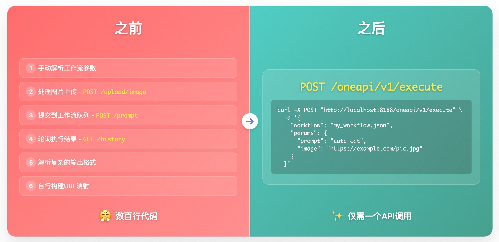

# ComfyUI-OneAPI ✨

ComfyUI-OneAPI 是一个为 ComfyUI 提供简单REST API接口的插件，只需一个API请求即可执行复杂的ComfyUI工作流。

[English Documentation](README.md)

## 🎯 为什么选择 ComfyUI-OneAPI？



### ✨ 核心特点
- **极简调用** - 只需一个REST API请求即可执行复杂的ComfyUI工作流
- **动态参数替换** - 通过节点标题标记实现参数动态替换，无需修改工作流文件
- **多种输入支持** - 支持JSON对象、本地文件名、URL三种workflow输入方式
- **智能输出管理** - 自动区分多个SaveImage节点输出，便于处理复杂工作流
- **UI界面集成** - 提供右键菜单快速保存API工作流和设置节点参数
- **灵活标记系统** - 支持输入参数标记（`$param.field`）和输出标记（`$output.name`）

### 🚀 核心优势
- **代码量减少95%** - 从数百行复杂逻辑简化为单个API调用
- **统一错误处理** - 内置完整的异常处理和错误恢复机制
- **参数化工作流** - 通过节点标题标记实现动态参数替换
- **智能文件处理** - 自动处理图片上传、URL下载、临时文件管理
- **结果自动分类** - 智能区分和分类不同类型的输出结果
- **零学习成本** - 保持ComfyUI工作流不变，仅需添加简单标记

## ⚡️ 快速开始

### 📦 安装

1. 打开终端/命令行
2. 切换到ComfyUI的custom_nodes目录：
   ```bash
   cd ComfyUI/custom_nodes
   ```
3. 克隆此仓库：
   ```bash
   git clone https://github.com/puke3615/ComfyUI-OneAPI.git
   ```
4. 重启ComfyUI

### 🚀 仅需一个请求即可执行工作流

```bash
curl -X POST "http://localhost:8188/oneapi/v1/execute" \
  -H "Content-Type: application/json" \
  -d '{
    "workflow": {...}  # 支持JSON对象、本地文件名或URL
  }'
```

### 📝 最简单的请求格式

```
{
  "workflow": {...}  // 工作流的API版JSON
}
```

### 📤 常见响应格式

```json
{
  "status": "completed",
  "images": ["http://server/image1.png", "http://server/image2.png"]
}
```

## 🔥 进阶用法

### 1️⃣ 动态替换参数 - 告别工作流修改 🔄

在节点标题中添加标记，轻松替换参数：

```
// 请求
{
  "workflow": {...},
  "params": {
    "prompt": "cute cat",
    "input_image": "https://example.com/image.jpg"
  }
}
```

**✨ 如何标记节点：**
- 📝 文本提示：在CLIPTextEncode节点标题添加 `$prompt.text`
- 🖼️ 输入图像：在LoadImage节点标题添加 `$input_image`

### 2️⃣ 区分多个输出 - 处理复杂工作流 🧩

当工作流有多个SaveImage节点时，轻松区分不同输出：

```
// 响应
{
  "status": "completed",
  "images": ["http://server/image1.png", "http://server/image2.png"],
  "images_by_var": {
    "background": ["http://server/image1.png"],
    "character": ["http://server/image2.png"]
  }
}
```

**✨ 如何标记输出节点：**
- 💾 在SaveImage节点标题添加 `$output.background` 或 `$output.character`

## 📋 高级功能

### 🖥️ 界面功能

此插件为 ComfyUI 界面添加了便捷的功能：

#### 📝 保存工作流为API

**使用方法：**
1. 在画布空白处右键
2. 选择"🚀 Save Workflow as API"
3. 在对话框中输入工作流名称
4. 选择是否覆盖已存在的文件
5. 点击"保存"

工作流将保存到 `user/default/api_workflows/` 目录下，生成可用于API调用的JSON文件。

#### 🏷️ 设置节点输入参数

**使用方法：**
1. 选择工作流中的单个节点
2. 右键点击节点
3. 选择"🚀 Set Node Input"
4. 从列表中选择要参数化的字段
5. 输入参数的变量名
6. 节点标题将自动更新参数标记

**示例：**
- 选择 CLIPTextEncode 节点
- 选择"text"字段
- 输入"prompt"作为变量名
- 节点标题将更新为包含 `$prompt.text`

此功能让您无需手动编辑节点标题，即可轻松标记节点以进行参数替换。

### 🔌 API参数详解

```
POST /oneapi/v1/execute

请求体:
{
    "workflow": {...},               // 支持JSON对象、本地文件名或URL
    "params": {...},                 // 可选：参数映射
    "wait_for_result": true/false,   // 可选：是否等待结果（默认true）
    "timeout": 300                   // 可选：超时时间（秒）
}
```

### 🏷️ 节点标题标记规则

#### ⬇️ 输入参数标记

1. 🖼️ LoadImage节点：使用 `$image_param` 格式
2. 🔄 其他节点：使用 `$param.field_name` 格式

示例：
- `$input_image` - LoadImage节点使用params.input_image作为图片
- `$prompt.text` - 使用params.prompt替换text字段

#### ⬆️ 输出标记

在SaveImage节点标题中添加标记：
- 格式：`$output.name`（如：`$output.background`）
- 无标记时使用节点ID作为标识

## 🔍 示例

### 📝 文生图示例

```bash
curl -X POST "http://localhost:8188/oneapi/v1/execute" \
  -H "Content-Type: application/json" \
  -d '{
    "workflow": "$(cat workflows/example_workflow.json)",  # 支持JSON对象、本地文件名或URL
    "params": {
        "prompt": "a cute dog with a red hat"
    }
  }'
```

### 🖼️ 图生图示例

```bash
curl -X POST "http://localhost:8188/oneapi/v1/execute" \
  -H "Content-Type: application/json" \
  -d '{
    "workflow": "$(cat workflows/example_img2img_workflow.json)",  # 支持JSON对象、本地文件名或URL
    "params": {
        "prompt": "a cute dog with a red hat",
        "image": "https://example.com/input.jpg"
    }
  }'
```

## ⚠️ 注意事项

- 🔄 此插件使用HTTP轮询获取结果，不提供WebSocket实时进度
- ⏱️ 长时间运行的工作流可能导致超时，请设置合适的timeout值
- 🏷️ 参数映射和输出标记依赖于节点标题中的特殊标记 

## /oneapi/v1/execute 接口说明

### workflow 参数支持三种形式

- 1. 直接传递 workflow 的 JSON 对象（原有逻辑）。
- 2. 传递本地 workflow 文件名（如 `1.json`），会自动从 `user/default/api_workflows/1.json` 读取。
- 3. 传递 workflow 的 URL（如 `http://xxx/1.json`），会自动下载并解析。

区分方式：
- 如果 workflow 是 dict，则直接用。
- 如果 workflow 是字符串且以 `http://` 或 `https://` 开头，则当作 URL 下载。
- 否则当作本地文件名，从 `user/default/workflows` 目录加载。

**示例：**
```
// 1. 直接传 JSON
{"workflow": {"node1": {...}, ...}}

// 2. 传本地文件名
// 1.json 对应的是 <ComfyUI根目录>/user/default/api_workflows/1.json
{"workflow": "1.json"}

// 3. 传 URL
{"workflow": "https://example.com/1.json"}
``` 
